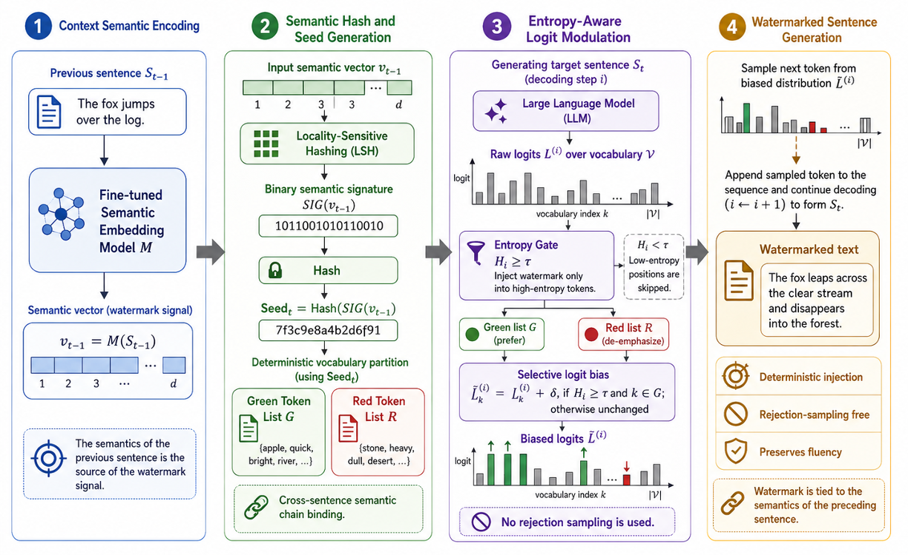
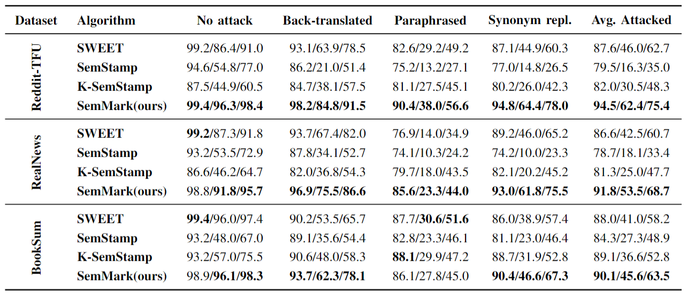

# SemMark: Robust Large Language Model Watermarking via Semantic Chain-Binding

Official implementation of the paper:

**SemMark: Robust Large Language Model Watermarking via Semantic Chain-Binding**

## Overview

SemMark is a semantic-level watermarking framework designed for Large Language Models (LLMs).

Unlike traditional token-level watermarking methods that are highly vulnerable to paraphrasing attacks, SemMark binds watermark signals to stable sentence-level semantic representations through:

* Contrastive Fine-Tuning
* Locality Sensitive Hashing (LSH)
* Semantic Chain-Binding
* Entropy-Aware Watermark Injection

The framework avoids expensive rejection sampling while maintaining strong robustness against semantic-preserving attacks.
## Framework

<p align="center">
  
</p>

<p align="center">
Overview of SemMark. The watermark signal is generated from the semantic signature of the previous sentence through locality-sensitive hashing (LSH), and injected into high-entropy decoding positions via entropy-aware logit modulation.
</p>
## Main Results

<p align="center">
  
</p>

<p align="center">
Performance comparison against SWEET, SemStamp, and K-SemStamp across RealNews, Reddit-TIFU, and BookSum datasets under multiple adversarial attacks.
</p>
---

## Environment Setup

Create a Python environment:

```bash
conda create -n semmark python=3.10
conda activate semmark

pip install -r requirements.txt
```


## Model Download

The models used in our experiments are available at the following links:

* **Generation Model:** [Qwen3-8B][qwen3-8b]
* **Embedding Model:** [Qwen3-Embedding-0.6B][qwen3-embedding]

[qwen3-8b]: https://huggingface.co/Qwen/Qwen3-8B
[qwen3-embedding]: https://huggingface.co/Qwen/Qwen3-Embedding-0.6B

---

## Dataset Preparation

Place datasets under:

```text
dataset/
└── benchmark_datasets/
    ├── booksum_10k_ready-8000/
    ├── realnews_10k-8000/
    └── reddit_tifu_10k_ready-8000/
```

---

# Reproducing SemMark

## Step 1: Train Semantic Encoder

Train the watermark-oriented semantic embedding model:

```bash
python a-ciwater-lsh.py
```

The training process performs contrastive fine-tuning to improve semantic robustness under paraphrasing attacks.

---

## Step 2: Export the Trained Model

Package the trained embedding model:

```bash
python export_model.py
```

This step generates the exported encoder used during watermark generation and detection.

---

## Step 3: Generate Watermarked Text

Generate watermarked samples with SemMark:

```bash
CUDA_VISIBLE_DEVICES=0,1 python sampling.py \
  dataset/benchmark_datasets/realnews_10k-8000-pegasus-merged/test \
  --model /path/to/Qwen3-8B \
  --embedder /path/to/my_watermark_embedder_finetuned_realnews \
```

SemMark uses:

* Qwen3-8B for text generation
* Exported semantic encoder for seed construction
* LSH-based semantic signatures
* Entropy-aware watermark injection

---

## Step 4: Perform Adversarial Attacks

Generate paraphrased adversarial texts using GPT-4o-mini:

```bash
python paraphrase_gen.py \
  python paraphrase_gen.py \
  --data_path path/to/watermarked_dataset \
  --paraphraser openai

---

## Step 5: Watermark Detection

Detect watermark signals:

```bash
python detection_sweet.py
```

The detector reconstructs semantic seeds and performs statistical verification on high-entropy tokens.

---

## Main Files

| File               | Description                           |
| ------------------ | ------------------------------------- |
| a-ciwater-lsh.py   | Contrastive semantic encoder training |
| export_model.py    | Export trained embedding model        |
| sampling.py        | Watermark generation                  |
| paraphrase_gen.py  | Adversarial attack generation         |
| detection_sweet.py | Watermark detection                   |
| eval_clm.py        | Text quality evaluation               |
| calibrate_sweet.py | Entropy threshold calibration         |

---

## Citation

```bibtex
@article{qiang2026semmark,
  title={SemMark: Robust Large Language Model Watermarking via Semantic Chain-Binding},
  author={Qiang, Zihao and Qiang, Jipeng and Hao, Jifei and Zhu, Yi and Zhao, Xiangyu and Sun, Zhu},
  year={2026}
}
```

---

## Contact

Zihao Qiang

Yangzhou University

Email: [mx120250577@stu.yzu.edu.cn](mailto:mx120250577@stu.yzu.edu.cn)
